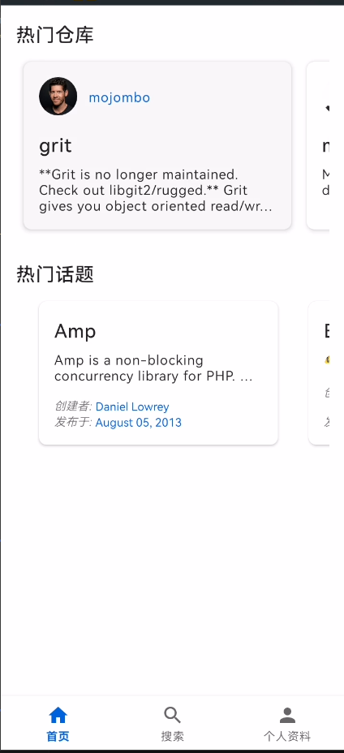

# GitHub Demo Android客户端

这是一个使用GitHub API的Android客户端应用程序，允许用户浏览GitHub仓库、搜索内容和查看个人资料。

## 功能特点
- 浏览热门GitHub仓库和话题，无需登录
- 按照编程语言搜索仓库，并按星标数量排序
- 查看仓库详情，包括星标数、分支数和问题
- 使用OAuth登录GitHub账号
- 查看个人资料和个人仓库列表
- 为自己的仓库创建问题
- 支持横屏和竖屏模式
- 优雅的错误处理，如网络中断时的提示

## Download
/release/app-release.apk

## Screenshots
  
  

## 技术栈
- 使用Kotlin开发，支持API Level 29+
- 使用传统View系统和基于XML的布局
- MVVM架构，使用ViewModel和LiveData
- Retrofit和OkHttp用于网络请求
- Room数据库用于本地缓存
- Glide用于图片加载
- 协程处理异步任务
- 单元测试和UI测试

## 如何构建和运行
1. 克隆仓库
2. 在Android Studio中导入项目
3. 在`app/src/main/java/com/example/githubdemo/util/Constants.kt`文件中，配置你的GitHub OAuth应用程序的CLIENT_ID和CLIENT_SECRET
4. 运行应用程序

## 测试
本项目包含单元测试和UI测试：

- 单元测试: `./gradlew test`
- UI测试: `./gradlew connectedAndroidTest`

## UML图
+------------------+        +----------------+        +------------------+
|    Fragment      |        |   ViewModel    |        |    Repository    |
+------------------+        +----------------+        +------------------+
| - binding        |<------>| - liveData     |<------>| - apiService     |
| - viewModel      |        | - repository   |        | - localDatabase  |
| + setupViews()   |        | + loadData()   |        | + fetchData()    |
| + observeData()  |        | + updateData() |        | + cacheData()    |
+------------------+        +----------------+        +------------------+
^                          ^                         ^
|                          |                         |
+------------------+        +----------------+        +------------------+
|RepositoryDetail  |        |RepositoryDetail|        |GitHubRepository  |
|    Fragment      |        |   ViewModel    |        |      Impl        |
+------------------+        +----------------+        +------------------+
| - issueAdapter   |        | - repoData     |        | - gitHubService  |
| - readmeView     |        | - issues       |        | - database       |
| + onIssueCreated |        | - readmeContent|        | + getReadme()    |
+------------------+        +----------------+        +------------------+

## 许可证

MIT License 